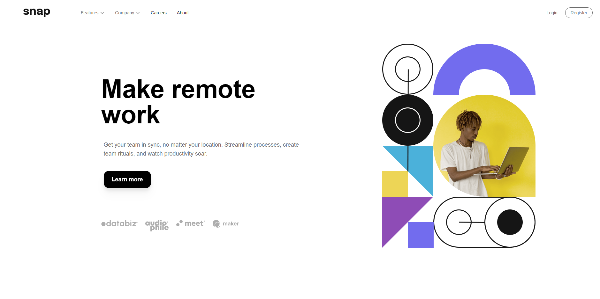
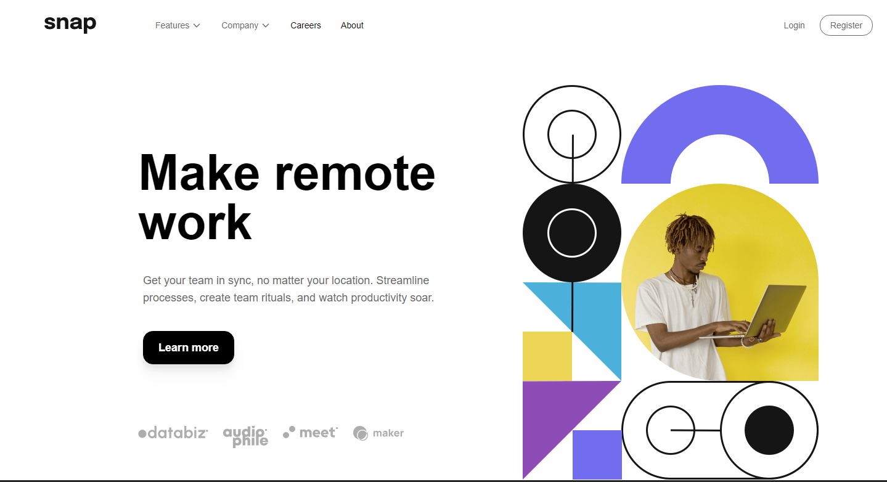

## Table of contents

- [Overview](#overview)
  - [The challenge](#the-challenge)
  - [Screenshot](#screenshot)
  - [Links](#links)
- [My process](#my-process)
  - [Built with](#built-with)
  - [What I learned](#what-i-learned)
  - [Continued development](#continued-development)
  - [Useful resources](#useful-resources)
- [Author](#author)
- [Acknowledgments](#acknowledgments)

## Overview

### The challenge

Users should be able to:

- View the relevant dropdown menus on desktop and mobile when interacting with the navigation links
- View the optimal layout for the content depending on their device's screen size
- See hover states for all interactive elements on the page

### Screenshot

https://prnt.sc/gxdMnwxt__Zq





### Links

- Solution URL: [https://github.com/tsquix/astro-projekt/]
- Live Site URL: [https://tsquix.github.io/astro-projekt/]

## My process

First, I started with the header structure and basic styling. Then, I created a container for the main content and arranged text and images into two columns. Next, I made the site responsive by adding Tailwind CSS classes for different screen sizes. Last but not least, I created a mobile hamburger menu and deployed the entire site.

### Built with

- Semantic HTML5 markup
- Tailwind / Tailwind custom properties
- Flexbox
- CSS Grid
- Javascript

### What I learned

I faced most of my difficulties with deploying the entire page, as I had never done it before. This process was challenging, but I believe it was the most valuable learning experience of this project.

Additionally, I learned how to create custom Tailwind CSS properties, such as the ones below:

```css
dropShadow: {
"custom-lg": "0 10px 8px rgba(0, 0, 0, 0.4), 0 4px 3px rgba(0, 0, 0, 0.8)",
},
scale: {
60: "0.6",
},
```

### Continued development

In the future, I’d like to focus on React. I wasn’t able to integrate it with Astro as I had hoped, but I plan to tackle this in future projects.

Additionally, I want to deepen my understanding of Astro itself, as this was my first experience with the framework.

I also found Tailwind CSS custom properties to be useful, and I aim to refine and perfect them further.

### Useful resources

- [https://tailwindcss.com/docs/] - The complete Tailwind CSS documentation was crucial in helping me manage styling challenges.

## Author

- Website - [Filip Stochel]
- Github - [github.com/tsquix/]

## Acknowledgments
